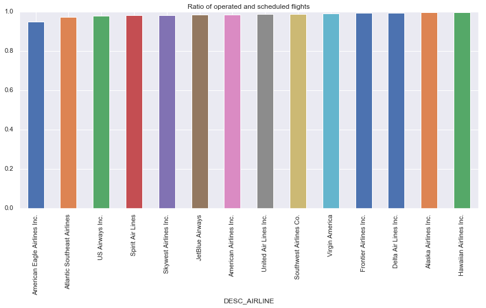
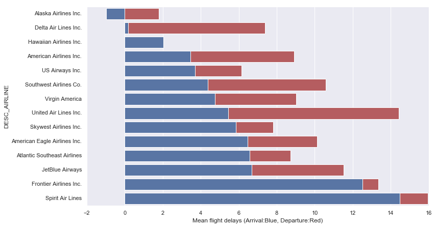
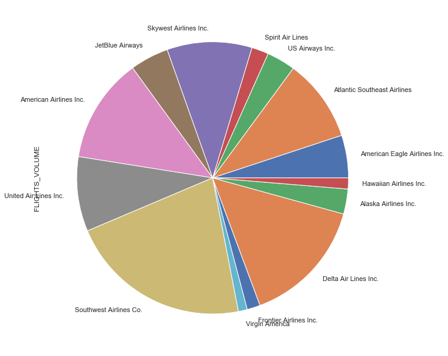
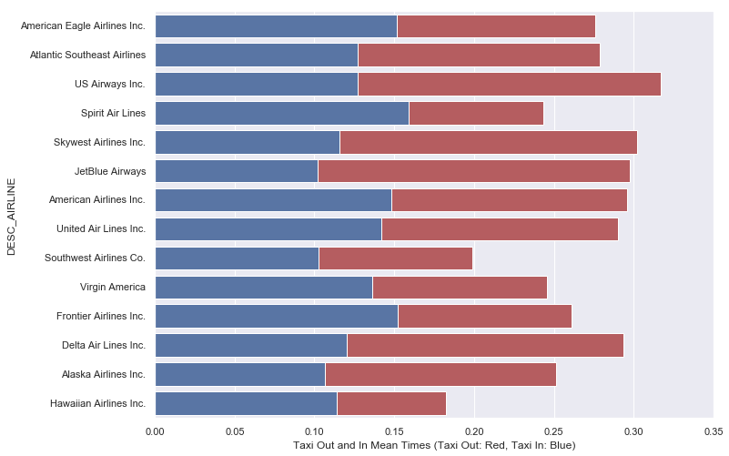
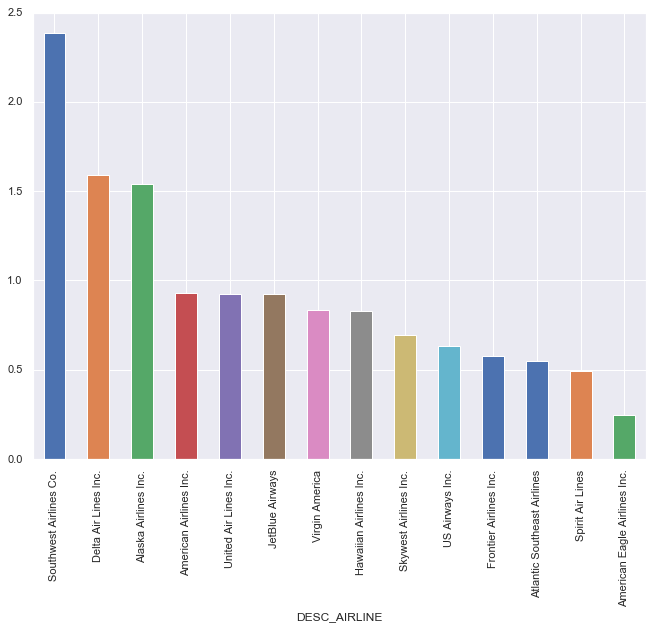
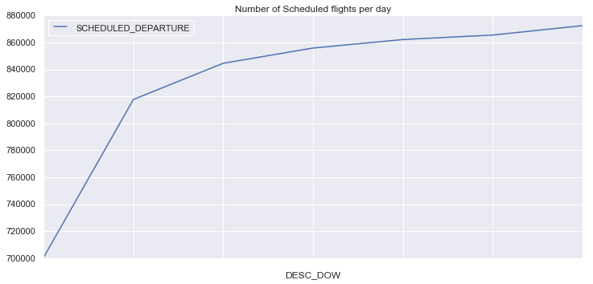
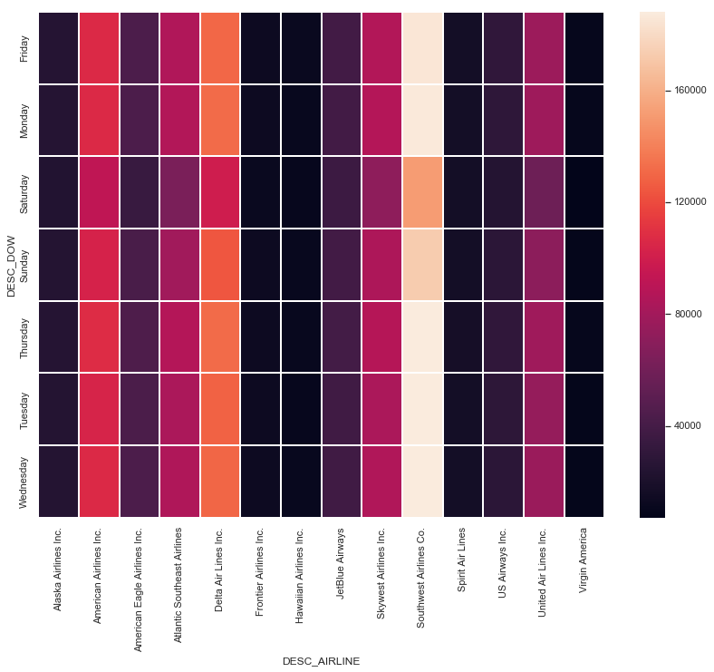
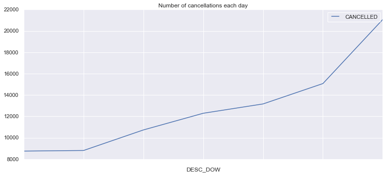
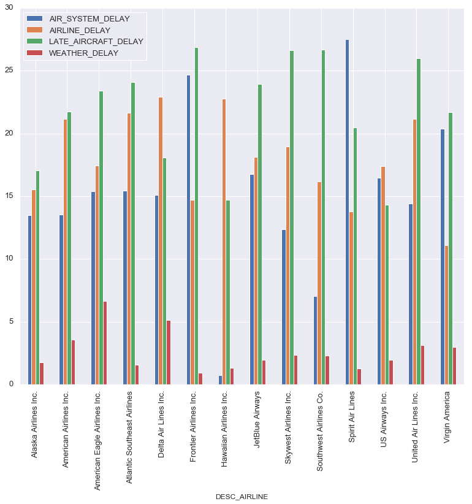

# Flight Delay Analysis


```python
import pandas as pd
import numpy as np
import glob
import matplotlib.pyplot as plt
import seaborn as sns
sns.set()
current_palette = sns.color_palette()
sns.palplot(current_palette)
%matplotlib inline
```


```python
# read all three data files
airlines = pd.read_csv('data/airlines.csv')
airports = pd.read_csv('data/airports.csv')
flights = pd.read_csv('data/flights.csv')
```

    C:\Users\Masood\Anaconda3\lib\site-packages\IPython\core\interactiveshell.py:3020: DtypeWarning: Columns (7,8) have mixed types. Specify dtype option on import or set low_memory=False.
      interactivity=interactivity, compiler=compiler, result=result)
    


```python
airlines.head()
```


<div>
<style scoped>
    .dataframe tbody tr th:only-of-type {
        vertical-align: middle;
    }

    .dataframe tbody tr th {
        vertical-align: top;
    }

    .dataframe thead th {
        text-align: right;
    }
</style>
<table border="1" class="dataframe">
  <thead>
    <tr style="text-align: right;">
      <th></th>
      <th>IATA_CODE</th>
      <th>AIRLINE</th>
    </tr>
  </thead>
  <tbody>
    <tr>
      <th>0</th>
      <td>UA</td>
      <td>United Air Lines Inc.</td>
    </tr>
    <tr>
      <th>1</th>
      <td>AA</td>
      <td>American Airlines Inc.</td>
    </tr>
    <tr>
      <th>2</th>
      <td>US</td>
      <td>US Airways Inc.</td>
    </tr>
    <tr>
      <th>3</th>
      <td>F9</td>
      <td>Frontier Airlines Inc.</td>
    </tr>
    <tr>
      <th>4</th>
      <td>B6</td>
      <td>JetBlue Airways</td>
    </tr>
  </tbody>
</table>
</div>


```python
airlines.info()
```

    <class 'pandas.core.frame.DataFrame'>
    RangeIndex: 14 entries, 0 to 13
    Data columns (total 2 columns):
    IATA_CODE    14 non-null object
    AIRLINE      14 non-null object
    dtypes: object(2)
    memory usage: 304.0+ bytes
    

The `airlines` file contains the airline name as well as thier IATA Code. That's it.


```python
airports.head()
```


<div>
<style scoped>
    .dataframe tbody tr th:only-of-type {
        vertical-align: middle;
    }

    .dataframe tbody tr th {
        vertical-align: top;
    }

    .dataframe thead th {
        text-align: right;
    }
</style>
<table border="1" class="dataframe">
  <thead>
    <tr style="text-align: right;">
      <th></th>
      <th>IATA_CODE</th>
      <th>AIRPORT</th>
      <th>CITY</th>
      <th>STATE</th>
      <th>COUNTRY</th>
      <th>LATITUDE</th>
      <th>LONGITUDE</th>
    </tr>
  </thead>
  <tbody>
    <tr>
      <th>0</th>
      <td>ABE</td>
      <td>Lehigh Valley International Airport</td>
      <td>Allentown</td>
      <td>PA</td>
      <td>USA</td>
      <td>40.65236</td>
      <td>-75.44040</td>
    </tr>
    <tr>
      <th>1</th>
      <td>ABI</td>
      <td>Abilene Regional Airport</td>
      <td>Abilene</td>
      <td>TX</td>
      <td>USA</td>
      <td>32.41132</td>
      <td>-99.68190</td>
    </tr>
    <tr>
      <th>2</th>
      <td>ABQ</td>
      <td>Albuquerque International Sunport</td>
      <td>Albuquerque</td>
      <td>NM</td>
      <td>USA</td>
      <td>35.04022</td>
      <td>-106.60919</td>
    </tr>
    <tr>
      <th>3</th>
      <td>ABR</td>
      <td>Aberdeen Regional Airport</td>
      <td>Aberdeen</td>
      <td>SD</td>
      <td>USA</td>
      <td>45.44906</td>
      <td>-98.42183</td>
    </tr>
    <tr>
      <th>4</th>
      <td>ABY</td>
      <td>Southwest Georgia Regional Airport</td>
      <td>Albany</td>
      <td>GA</td>
      <td>USA</td>
      <td>31.53552</td>
      <td>-84.19447</td>
    </tr>
  </tbody>
</table>
</div>


```python
airports.info()
```

    <class 'pandas.core.frame.DataFrame'>
    RangeIndex: 322 entries, 0 to 321
    Data columns (total 7 columns):
    IATA_CODE    322 non-null object
    AIRPORT      322 non-null object
    CITY         322 non-null object
    STATE        322 non-null object
    COUNTRY      322 non-null object
    LATITUDE     319 non-null float64
    LONGITUDE    319 non-null float64
    dtypes: float64(2), object(5)
    memory usage: 17.7+ KB
    

The `airports` file contains the location of 322 airports. There over 40,000 airports in the world (including private and smaller ones). This only contains the major airports.


```python
flights.head()
```


<div>
<style scoped>
    .dataframe tbody tr th:only-of-type {
        vertical-align: middle;
    }

    .dataframe tbody tr th {
        vertical-align: top;
    }

    .dataframe thead th {
        text-align: right;
    }
</style>
<table border="1" class="dataframe">
  <thead>
    <tr style="text-align: right;">
      <th></th>
      <th>YEAR</th>
      <th>MONTH</th>
      <th>DAY</th>
      <th>DAY_OF_WEEK</th>
      <th>AIRLINE</th>
      <th>FLIGHT_NUMBER</th>
      <th>TAIL_NUMBER</th>
      <th>ORIGIN_AIRPORT</th>
      <th>DESTINATION_AIRPORT</th>
      <th>SCHEDULED_DEPARTURE</th>
      <th>...</th>
      <th>ARRIVAL_TIME</th>
      <th>ARRIVAL_DELAY</th>
      <th>DIVERTED</th>
      <th>CANCELLED</th>
      <th>CANCELLATION_REASON</th>
      <th>AIR_SYSTEM_DELAY</th>
      <th>SECURITY_DELAY</th>
      <th>AIRLINE_DELAY</th>
      <th>LATE_AIRCRAFT_DELAY</th>
      <th>WEATHER_DELAY</th>
    </tr>
  </thead>
  <tbody>
    <tr>
      <th>0</th>
      <td>2015</td>
      <td>1</td>
      <td>1</td>
      <td>4</td>
      <td>AS</td>
      <td>98</td>
      <td>N407AS</td>
      <td>ANC</td>
      <td>SEA</td>
      <td>5</td>
      <td>...</td>
      <td>408.0</td>
      <td>-22.0</td>
      <td>0</td>
      <td>0</td>
      <td>NaN</td>
      <td>NaN</td>
      <td>NaN</td>
      <td>NaN</td>
      <td>NaN</td>
      <td>NaN</td>
    </tr>
    <tr>
      <th>1</th>
      <td>2015</td>
      <td>1</td>
      <td>1</td>
      <td>4</td>
      <td>AA</td>
      <td>2336</td>
      <td>N3KUAA</td>
      <td>LAX</td>
      <td>PBI</td>
      <td>10</td>
      <td>...</td>
      <td>741.0</td>
      <td>-9.0</td>
      <td>0</td>
      <td>0</td>
      <td>NaN</td>
      <td>NaN</td>
      <td>NaN</td>
      <td>NaN</td>
      <td>NaN</td>
      <td>NaN</td>
    </tr>
    <tr>
      <th>2</th>
      <td>2015</td>
      <td>1</td>
      <td>1</td>
      <td>4</td>
      <td>US</td>
      <td>840</td>
      <td>N171US</td>
      <td>SFO</td>
      <td>CLT</td>
      <td>20</td>
      <td>...</td>
      <td>811.0</td>
      <td>5.0</td>
      <td>0</td>
      <td>0</td>
      <td>NaN</td>
      <td>NaN</td>
      <td>NaN</td>
      <td>NaN</td>
      <td>NaN</td>
      <td>NaN</td>
    </tr>
    <tr>
      <th>3</th>
      <td>2015</td>
      <td>1</td>
      <td>1</td>
      <td>4</td>
      <td>AA</td>
      <td>258</td>
      <td>N3HYAA</td>
      <td>LAX</td>
      <td>MIA</td>
      <td>20</td>
      <td>...</td>
      <td>756.0</td>
      <td>-9.0</td>
      <td>0</td>
      <td>0</td>
      <td>NaN</td>
      <td>NaN</td>
      <td>NaN</td>
      <td>NaN</td>
      <td>NaN</td>
      <td>NaN</td>
    </tr>
    <tr>
      <th>4</th>
      <td>2015</td>
      <td>1</td>
      <td>1</td>
      <td>4</td>
      <td>AS</td>
      <td>135</td>
      <td>N527AS</td>
      <td>SEA</td>
      <td>ANC</td>
      <td>25</td>
      <td>...</td>
      <td>259.0</td>
      <td>-21.0</td>
      <td>0</td>
      <td>0</td>
      <td>NaN</td>
      <td>NaN</td>
      <td>NaN</td>
      <td>NaN</td>
      <td>NaN</td>
      <td>NaN</td>
    </tr>
  </tbody>
</table>
<p>5 rows × 31 columns</p>
</div>


```python
flights.info()
```

    <class 'pandas.core.frame.DataFrame'>
    RangeIndex: 5819079 entries, 0 to 5819078
    Data columns (total 31 columns):
    YEAR                   int64
    MONTH                  int64
    DAY                    int64
    DAY_OF_WEEK            int64
    AIRLINE                object
    FLIGHT_NUMBER          int64
    TAIL_NUMBER            object
    ORIGIN_AIRPORT         object
    DESTINATION_AIRPORT    object
    SCHEDULED_DEPARTURE    int64
    DEPARTURE_TIME         float64
    DEPARTURE_DELAY        float64
    TAXI_OUT               float64
    WHEELS_OFF             float64
    SCHEDULED_TIME         float64
    ELAPSED_TIME           float64
    AIR_TIME               float64
    DISTANCE               int64
    WHEELS_ON              float64
    TAXI_IN                float64
    SCHEDULED_ARRIVAL      int64
    ARRIVAL_TIME           float64
    ARRIVAL_DELAY          float64
    DIVERTED               int64
    CANCELLED              int64
    CANCELLATION_REASON    object
    AIR_SYSTEM_DELAY       float64
    SECURITY_DELAY         float64
    AIRLINE_DELAY          float64
    LATE_AIRCRAFT_DELAY    float64
    WEATHER_DELAY          float64
    dtypes: float64(16), int64(10), object(5)
    memory usage: 1.3+ GB
    

The `flights` file contains every information we would need for analysis.

Info on a few import features:
- `AIR_TIME` - time duration between wheels_off and wheels_on time.
- `WHEELS_OFF` time point that the aircraft's wheels leave the ground.
- `WHEELS_ON` time point that the aircraft's wheels touch on the ground.
- `TAXI_OUT` time duration elapsed between departure from the origin airport gate and wheels off.
- `TAXI_IN` time duration elapsed between wheels-on and gate arrival at the destination airport.

- `departure_time` = `wheels_off` - `taxi_out`
- `departure_delay` = `departure_time` - `scheduled_departure`
- `arrival_time` = `wheels_on` + `taxi_in`
- `arrival_delay` = `arrival_time` - `scheduled_arrival`
- `elapsed_time` = `air_time` + `taxi_in` + `taxi_out`
- `air_time` = `wheels_on` - `wheels_off`


The time is formatted in hour:mintues (xx:yy). Example: 1458 indicates 1:58pm (or 14:58). Features which follow this formate are:
`scheduled_departure`, `departure_time`, `scheduled_arrival`, `arrival_time`, `wheels_off`, `wheels_on`

The following are only in minutes:
`arrival_delay`, `departure_delay`, `taxi_in`, `taxi_out`, `scheduled_time`, `elapsed_time`, `air_time`


```python
# check for missing values 
flights.isna().sum()
```


    YEAR                         0
    MONTH                        0
    DAY                          0
    DAY_OF_WEEK                  0
    AIRLINE                      0
    FLIGHT_NUMBER                0
    TAIL_NUMBER              14721
    ORIGIN_AIRPORT               0
    DESTINATION_AIRPORT          0
    SCHEDULED_DEPARTURE          0
    DEPARTURE_TIME           86153
    DEPARTURE_DELAY          86153
    TAXI_OUT                 89047
    WHEELS_OFF               89047
    SCHEDULED_TIME               6
    ELAPSED_TIME            105071
    AIR_TIME                105071
    DISTANCE                     0
    WHEELS_ON                92513
    TAXI_IN                  92513
    SCHEDULED_ARRIVAL            0
    ARRIVAL_TIME             92513
    ARRIVAL_DELAY           105071
    DIVERTED                     0
    CANCELLED                    0
    CANCELLATION_REASON    5729195
    AIR_SYSTEM_DELAY       4755640
    SECURITY_DELAY         4755640
    AIRLINE_DELAY          4755640
    LATE_AIRCRAFT_DELAY    4755640
    WEATHER_DELAY          4755640
    dtype: int64


`DAY_OF_WEEK` is represented as a numeric value. I will convert this to the day names. The data file did not specify what number corresponds to which day, so using the first row YEAR = 1, MONTH = 1, DAY = 1. DAY_OF_WEEK =4 (ie. Jan 1, 2015), I concluded that 1 corresponds to Monday and 2 corresponds to Tuesday, etc.


```python
flights['DAY_OF_WEEK'].unique()
day_of_week_desc={
    1:'Monday',
    2:'Tuesday',
    3:'Wednesday',
    4:'Thursday',
    5:'Friday',
    6:'Saturday',
    7:'Sunday'}

flights['DESC_DOW'] = flights['DAY_OF_WEEK'].apply(lambda x:day_of_week_desc[x])
flights.head()['DESC_DOW']
```


    0    Thursday
    1    Thursday
    2    Thursday
    3    Thursday
    4    Thursday
    Name: DESC_DOW, dtype: object


```python
airlines_dict = dict(zip(airlines['IATA_CODE'],airlines['AIRLINE']))
airport_dict = dict(zip(airports['IATA_CODE'],airports['AIRPORT']))
flights['DESC_AIRLINE'] = flights['AIRLINE'].apply(lambda x: airlines_dict[x])
flights.head()['DESC_AIRLINE']
```


    0      Alaska Airlines Inc.
    1    American Airlines Inc.
    2           US Airways Inc.
    3    American Airlines Inc.
    4      Alaska Airlines Inc.
    Name: DESC_AIRLINE, dtype: object


A quick google search determined that a following factors are attributed to what makes a great airline. 
- Ratio of operated flights by scheduled flights
- Flight speed
- Average arrival delay
- Flight volume
- Taxi In and Out Time


```python
#flights.CANCELLED.unique() #0,1
# a airline flight is either cancelled or not (meaning the flight is opertating)
airlines_top = pd.DataFrame(flights.groupby('DESC_AIRLINE').count()['SCHEDULED_DEPARTURE'])
airlines_top['CANCELLED'] = flights.groupby('DESC_AIRLINE').sum()['CANCELLED']
airlines_top['OPERATED'] = airlines_top['SCHEDULED_DEPARTURE'] - airlines_top['CANCELLED']
airlines_top['RATIO_OP_SCH'] = airlines_top['OPERATED']/airlines_top['SCHEDULED_DEPARTURE']
airlines_top.drop(airlines_top.columns[[0,1,2]], axis=1, inplace=True)
airlines_top.head()
```


<div>
<style scoped>
    .dataframe tbody tr th:only-of-type {
        vertical-align: middle;
    }

    .dataframe tbody tr th {
        vertical-align: top;
    }

    .dataframe thead th {
        text-align: right;
    }
</style>
<table border="1" class="dataframe">
  <thead>
    <tr style="text-align: right;">
      <th></th>
      <th>RATIO_OP_SCH</th>
    </tr>
    <tr>
      <th>DESC_AIRLINE</th>
      <th></th>
    </tr>
  </thead>
  <tbody>
    <tr>
      <th>Alaska Airlines Inc.</th>
      <td>0.996122</td>
    </tr>
    <tr>
      <th>American Airlines Inc.</th>
      <td>0.984960</td>
    </tr>
    <tr>
      <th>American Eagle Airlines Inc.</th>
      <td>0.949004</td>
    </tr>
    <tr>
      <th>Atlantic Southeast Airlines</th>
      <td>0.973371</td>
    </tr>
    <tr>
      <th>Delta Air Lines Inc.</th>
      <td>0.995634</td>
    </tr>
  </tbody>
</table>
</div>


```python
airlines_top.sort_values(['RATIO_OP_SCH'], ascending = 1, inplace=True)
# airlines_top.head()
airlines_top['RATIO_OP_SCH'].plot(kind='bar', figsize=(14,6), rot=90)
plt.title('Ratio of operated and scheduled flights')
```


    Text(0.5, 1.0, 'Ratio of operated and scheduled flights')





```python
flights['FLIGHT_SPEED'] = 60*flights['DISTANCE']/flights['AIR_TIME']
airlines_top['FLIGHT_SPEED'] = flights.groupby('DESC_AIRLINE')['FLIGHT_SPEED'].mean()
flights[['DESC_AIRLINE','FLIGHT_SPEED']].boxplot(column = 'FLIGHT_SPEED',by='DESC_AIRLINE',figsize=(13,7),rot=90)
```


    <matplotlib.axes._subplots.AxesSubplot at 0x19a5d3d9e80>


```python
airlines_top.head()
```


<div>
<style scoped>
    .dataframe tbody tr th:only-of-type {
        vertical-align: middle;
    }

    .dataframe tbody tr th {
        vertical-align: top;
    }

    .dataframe thead th {
        text-align: right;
    }
</style>
<table border="1" class="dataframe">
  <thead>
    <tr style="text-align: right;">
      <th></th>
      <th>RATIO_OP_SCH</th>
      <th>FLIGHT_SPEED</th>
    </tr>
    <tr>
      <th>DESC_AIRLINE</th>
      <th></th>
      <th></th>
    </tr>
  </thead>
  <tbody>
    <tr>
      <th>American Eagle Airlines Inc.</th>
      <td>0.949004</td>
      <td>360.899443</td>
    </tr>
    <tr>
      <th>Atlantic Southeast Airlines</th>
      <td>0.973371</td>
      <td>364.683738</td>
    </tr>
    <tr>
      <th>US Airways Inc.</th>
      <td>0.979534</td>
      <td>411.108496</td>
    </tr>
    <tr>
      <th>Spirit Air Lines</th>
      <td>0.982927</td>
      <td>436.499865</td>
    </tr>
    <tr>
      <th>Skywest Airlines Inc.</th>
      <td>0.983071</td>
      <td>368.598815</td>
    </tr>
  </tbody>
</table>
</div>


```python
airlines_top['FLIGHT_SPEED'].mean()
```


    409.02464587790536


The average speed of flights is 409 miles per hour.


```python
flights.groupby('DESC_AIRLINE')[['ARRIVAL_DELAY','DEPARTURE_DELAY']].mean()

# arrival delay 
airlines_top['ARRIVAL_DELAY']= flights.groupby('DESC_AIRLINE')['ARRIVAL_DELAY'].mean()

# convert ARRIVAL_DELAY to hours
airlines_top['ARRIVAL_DELAY']=airlines_top['ARRIVAL_DELAY'].apply(lambda x:x/60)

airlines_top.head()
```


<div>
<style scoped>
    .dataframe tbody tr th:only-of-type {
        vertical-align: middle;
    }

    .dataframe tbody tr th {
        vertical-align: top;
    }

    .dataframe thead th {
        text-align: right;
    }
</style>
<table border="1" class="dataframe">
  <thead>
    <tr style="text-align: right;">
      <th></th>
      <th>RATIO_OP_SCH</th>
      <th>FLIGHT_SPEED</th>
      <th>ARRIVAL_DELAY</th>
    </tr>
    <tr>
      <th>DESC_AIRLINE</th>
      <th></th>
      <th></th>
      <th></th>
    </tr>
  </thead>
  <tbody>
    <tr>
      <th>American Eagle Airlines Inc.</th>
      <td>0.949004</td>
      <td>360.899443</td>
      <td>0.107631</td>
    </tr>
    <tr>
      <th>Atlantic Southeast Airlines</th>
      <td>0.973371</td>
      <td>364.683738</td>
      <td>0.109756</td>
    </tr>
    <tr>
      <th>US Airways Inc.</th>
      <td>0.979534</td>
      <td>411.108496</td>
      <td>0.061770</td>
    </tr>
    <tr>
      <th>Spirit Air Lines</th>
      <td>0.982927</td>
      <td>436.499865</td>
      <td>0.241197</td>
    </tr>
    <tr>
      <th>Skywest Airlines Inc.</th>
      <td>0.983071</td>
      <td>368.598815</td>
      <td>0.097428</td>
    </tr>
  </tbody>
</table>
</div>


Analysis of `ARRIVAL_DELAY` and `DEPARTURE_DELAY`


```python
df_delay = pd.DataFrame(flights.groupby('DESC_AIRLINE')[['ARRIVAL_DELAY','DEPARTURE_DELAY']].mean())
df_delay.sort_values(['ARRIVAL_DELAY','DEPARTURE_DELAY'],ascending = [1,1],inplace=True)
plt.figure(figsize=(12,7))
sns.set_context(font_scale=2.5)
plot = sns.barplot(x='DEPARTURE_DELAY',y=df_delay.index, data=df_delay,color = 'r')
plot = sns.barplot(x='ARRIVAL_DELAY',y=df_delay.index, data=df_delay,color = 'b')
plot.set(xlabel='Mean flight delays (Arrival:Blue, Departure:Red)')
```


    [Text(0.5, 0, 'Mean flight delays (Arrival:Blue, Departure:Red)')]





Off the bat, we see that Alaska Airlines has a negative arrival delay. Meaning that their flights arrive before its scheduled arrival time.

With the expection of United and American Airlines, all airlines have greater arrival delays than departure delays. Makes sense as a plane cannot depart if it has arrived late. Meaning depature delays are due to late arrivals.

Let's examine flight volume of each airline.


```python
airlines_top['FLIGHTS_VOLUME'] = flights.groupby('DESC_AIRLINE')['FLIGHT_NUMBER'].count()
# ratio of flight_vol/total flight_vol
total = airlines_top['FLIGHTS_VOLUME'].sum()
airlines_top['FLIGHTS_VOLUME'] = airlines_top['FLIGHTS_VOLUME'].apply(lambda x:(x/float(total)))
airlines_top['FLIGHTS_VOLUME'].plot.pie(figsize=(10,10),rot=45)
```


    <matplotlib.axes._subplots.AxesSubplot at 0x19a5e6e49e8>





Analysis of Taxi time.
- `TAXI_OUT`: time duration between departure from the origin airport gate and wheels off
- `TAXI_IN`: time duration between wheels-on and gate arrival at the destination airport


```python
airlines_top[['TAXI_IN','TAXI_OUT']] = flights.groupby('DESC_AIRLINE')[['TAXI_IN','TAXI_OUT']].mean()

# convert time to hours
airlines_top['TAXI_IN'] = airlines_top['TAXI_IN'].apply(lambda x:(x/float(60)))
airlines_top['TAXI_OUT'] = airlines_top['TAXI_OUT'].apply(lambda x:(x/float(60)))

plt.figure(figsize=(11, 8))
sns.set_context(font_scale=2.5)
plot = sns.barplot(x='TAXI_OUT',y=airlines_top.index,data = airlines_top,color = 'r')
plot = sns.barplot(x='TAXI_IN',y=airlines_top.index,data = airlines_top,color = 'b')
plot.set(xlabel='Taxi Out and In Mean Times (Taxi Out: Red, Taxi In: Blue)')
```


    [Text(0.5, 0, 'Taxi Out and In Mean Times (Taxi Out: Red, Taxi In: Blue)')]





Using the data we have generated, we can now rank the airlines. The formula I will use was given to me by instructor (score = a/(1+b)
a = speed, volume, raio of operated flights
b = arrival delay, taxi in, taxi out


```python
# needed help with this
# normalize the data (valued from 1-2)
for i in airlines_top.columns:
    airlines_top[i] = ((airlines_top[i]-airlines_top[i].min())/(airlines_top[i].max()-airlines_top[i].min()))+1

a = airlines_top.RATIO_OP_SCH * airlines_top.FLIGHT_SPEED * airlines_top.FLIGHTS_VOLUME
b = airlines_top.ARRIVAL_DELAY * airlines_top.TAXI_IN * airlines_top.TAXI_OUT

airlines_top['SCORE'] = a/(1+b)
airlines_top.sort_values(['SCORE'],ascending=False,inplace=True)

airlines_top.head()
```


<div>
<style scoped>
    .dataframe tbody tr th:only-of-type {
        vertical-align: middle;
    }

    .dataframe tbody tr th {
        vertical-align: top;
    }

    .dataframe thead th {
        text-align: right;
    }
</style>
<table border="1" class="dataframe">
  <thead>
    <tr style="text-align: right;">
      <th></th>
      <th>RATIO_OP_SCH</th>
      <th>FLIGHT_SPEED</th>
      <th>ARRIVAL_DELAY</th>
      <th>FLIGHTS_VOLUME</th>
      <th>TAXI_IN</th>
      <th>TAXI_OUT</th>
      <th>SCORE</th>
    </tr>
    <tr>
      <th>DESC_AIRLINE</th>
      <th></th>
      <th></th>
      <th></th>
      <th></th>
      <th></th>
      <th></th>
      <th></th>
    </tr>
  </thead>
  <tbody>
    <tr>
      <th>Southwest Airlines Co.</th>
      <td>1.785210</td>
      <td>1.693648</td>
      <td>1.346414</td>
      <td>2.000000</td>
      <td>1.013475</td>
      <td>1.122947</td>
      <td>2.387937</td>
    </tr>
    <tr>
      <th>Delta Air Lines Inc.</th>
      <td>1.956436</td>
      <td>1.734768</td>
      <td>1.075304</td>
      <td>1.678342</td>
      <td>1.316631</td>
      <td>1.826310</td>
      <td>1.588619</td>
    </tr>
    <tr>
      <th>Alaska Airlines Inc.</th>
      <td>1.966448</td>
      <td>1.890855</td>
      <td>1.000000</td>
      <td>1.092185</td>
      <td>1.081595</td>
      <td>1.514122</td>
      <td>1.539632</td>
    </tr>
    <tr>
      <th>American Airlines Inc.</th>
      <td>1.737491</td>
      <td>1.814826</td>
      <td>1.286628</td>
      <td>1.553423</td>
      <td>1.801936</td>
      <td>1.846313</td>
      <td>0.927619</td>
    </tr>
    <tr>
      <th>United Air Lines Inc.</th>
      <td>1.784566</td>
      <td>2.000000</td>
      <td>1.414811</td>
      <td>1.378198</td>
      <td>1.694786</td>
      <td>1.802211</td>
      <td>0.924385</td>
    </tr>
  </tbody>
</table>
</div>


```python
airlines_top['SCORE'].plot.bar(figsize = (11,8), rot=90)
```


    <matplotlib.axes._subplots.AxesSubplot at 0x19a5e17f390>





Based on our ranking system, Southwest Airlines is the favorite.

## Other insights from the data


```python
# which day in most busy
df_day = pd.DataFrame(flights.groupby('DESC_DOW').count()['SCHEDULED_DEPARTURE'])
df_day = df_day.sort_values(['SCHEDULED_DEPARTURE'])
df_day.head()
```


<div>
<style scoped>
    .dataframe tbody tr th:only-of-type {
        vertical-align: middle;
    }

    .dataframe tbody tr th {
        vertical-align: top;
    }

    .dataframe thead th {
        text-align: right;
    }
</style>
<table border="1" class="dataframe">
  <thead>
    <tr style="text-align: right;">
      <th></th>
      <th>SCHEDULED_DEPARTURE</th>
    </tr>
    <tr>
      <th>DESC_DOW</th>
      <th></th>
    </tr>
  </thead>
  <tbody>
    <tr>
      <th>Saturday</th>
      <td>700545</td>
    </tr>
    <tr>
      <th>Sunday</th>
      <td>817764</td>
    </tr>
    <tr>
      <th>Tuesday</th>
      <td>844600</td>
    </tr>
    <tr>
      <th>Wednesday</th>
      <td>855897</td>
    </tr>
    <tr>
      <th>Friday</th>
      <td>862209</td>
    </tr>
  </tbody>
</table>
</div>


```python
# for some reason the days of week are not showing up...
#day = ['Mo', 'Tu', 'We', 'Th', 'Fr', 'Sa', 'Su']
df_day.plot(kind='line', subplots=True, figsize=(12,6), legend=True)
plt.title('Number of Scheduled flights per day')
```


    Text(0.5, 1.0, 'Number of Scheduled flights per day')





Flight volume for each airline per day.


```python
flight_volume = flights.pivot_table(index="DESC_DOW",columns="DESC_AIRLINE",values="SCHEDULED_DEPARTURE",aggfunc=lambda x:x.count())
flight_volume.head()
```


<div>
<style scoped>
    .dataframe tbody tr th:only-of-type {
        vertical-align: middle;
    }

    .dataframe tbody tr th {
        vertical-align: top;
    }

    .dataframe thead th {
        text-align: right;
    }
</style>
<table border="1" class="dataframe">
  <thead>
    <tr style="text-align: right;">
      <th>DESC_AIRLINE</th>
      <th>Alaska Airlines Inc.</th>
      <th>American Airlines Inc.</th>
      <th>American Eagle Airlines Inc.</th>
      <th>Atlantic Southeast Airlines</th>
      <th>Delta Air Lines Inc.</th>
      <th>Frontier Airlines Inc.</th>
      <th>Hawaiian Airlines Inc.</th>
      <th>JetBlue Airways</th>
      <th>Skywest Airlines Inc.</th>
      <th>Southwest Airlines Co.</th>
      <th>Spirit Air Lines</th>
      <th>US Airways Inc.</th>
      <th>United Air Lines Inc.</th>
      <th>Virgin America</th>
    </tr>
    <tr>
      <th>DESC_DOW</th>
      <th></th>
      <th></th>
      <th></th>
      <th></th>
      <th></th>
      <th></th>
      <th></th>
      <th></th>
      <th></th>
      <th></th>
      <th></th>
      <th></th>
      <th></th>
      <th></th>
    </tr>
  </thead>
  <tbody>
    <tr>
      <th>Friday</th>
      <td>25135</td>
      <td>106374</td>
      <td>43869</td>
      <td>86299</td>
      <td>130234</td>
      <td>13242</td>
      <td>11662</td>
      <td>38801</td>
      <td>86611</td>
      <td>185731</td>
      <td>16991</td>
      <td>30246</td>
      <td>77634</td>
      <td>9380</td>
    </tr>
    <tr>
      <th>Monday</th>
      <td>25082</td>
      <td>106225</td>
      <td>43872</td>
      <td>86979</td>
      <td>131682</td>
      <td>13228</td>
      <td>10841</td>
      <td>38902</td>
      <td>87484</td>
      <td>187228</td>
      <td>16794</td>
      <td>29391</td>
      <td>78549</td>
      <td>9286</td>
    </tr>
    <tr>
      <th>Saturday</th>
      <td>23574</td>
      <td>92264</td>
      <td>34246</td>
      <td>63484</td>
      <td>99365</td>
      <td>11878</td>
      <td>10559</td>
      <td>35631</td>
      <td>71767</td>
      <td>151771</td>
      <td>16844</td>
      <td>24389</td>
      <td>57675</td>
      <td>7098</td>
    </tr>
    <tr>
      <th>Sunday</th>
      <td>24693</td>
      <td>103049</td>
      <td>41911</td>
      <td>79547</td>
      <td>124181</td>
      <td>13058</td>
      <td>10867</td>
      <td>38742</td>
      <td>84324</td>
      <td>173081</td>
      <td>16844</td>
      <td>27724</td>
      <td>71076</td>
      <td>8667</td>
    </tr>
    <tr>
      <th>Thursday</th>
      <td>25477</td>
      <td>108168</td>
      <td>44314</td>
      <td>87126</td>
      <td>132064</td>
      <td>13424</td>
      <td>11031</td>
      <td>39470</td>
      <td>87902</td>
      <td>187794</td>
      <td>17054</td>
      <td>30160</td>
      <td>79126</td>
      <td>9411</td>
    </tr>
  </tbody>
</table>
</div>


```python
fig = plt.figure(figsize=(14,10))
sns.heatmap(flight_volume, linewidths=1)
plt.xticks(rotation=90)
```


    (array([ 0.5,  1.5,  2.5,  3.5,  4.5,  5.5,  6.5,  7.5,  8.5,  9.5, 10.5,
            11.5, 12.5, 13.5]), <a list of 14 Text xticklabel objects>)





## Flight cancellations and the reason

`CANCELLATION_REASON` have letters for values and each letter corresponds to a reason for canellation.

- A - Carrier
- B - Weather
- C - National Air System
- D - Security


```python
df_cancel = pd.DataFrame(flights.groupby('DESC_DOW').sum()['CANCELLED'])
df_cancel=df_cancel.sort_values(['CANCELLED'])
df_cancel.head()
```


<div>
<style scoped>
    .dataframe tbody tr th:only-of-type {
        vertical-align: middle;
    }

    .dataframe tbody tr th {
        vertical-align: top;
    }

    .dataframe thead th {
        text-align: right;
    }
</style>
<table border="1" class="dataframe">
  <thead>
    <tr style="text-align: right;">
      <th></th>
      <th>CANCELLED</th>
    </tr>
    <tr>
      <th>DESC_DOW</th>
      <th></th>
    </tr>
  </thead>
  <tbody>
    <tr>
      <th>Saturday</th>
      <td>8749</td>
    </tr>
    <tr>
      <th>Friday</th>
      <td>8805</td>
    </tr>
    <tr>
      <th>Wednesday</th>
      <td>10729</td>
    </tr>
    <tr>
      <th>Thursday</th>
      <td>12291</td>
    </tr>
    <tr>
      <th>Sunday</th>
      <td>13165</td>
    </tr>
  </tbody>
</table>
</div>


```python
df_cancel.plot(kind='line', figsize=(13,6), subplots=True, legend=True)
plt.title('Number of cancellations each day')
```


    Text(0.5, 1.0, 'Number of cancellations each day')





```python
df_reason = pd.DataFrame(flights.groupby(['DESC_AIRLINE'])['AIR_SYSTEM_DELAY', 'AIRLINE_DELAY',
                                                           'LATE_AIRCRAFT_DELAY', 'WEATHER_DELAY'].mean())
df_reason.head()
```


<div>
<style scoped>
    .dataframe tbody tr th:only-of-type {
        vertical-align: middle;
    }

    .dataframe tbody tr th {
        vertical-align: top;
    }

    .dataframe thead th {
        text-align: right;
    }
</style>
<table border="1" class="dataframe">
  <thead>
    <tr style="text-align: right;">
      <th></th>
      <th>AIR_SYSTEM_DELAY</th>
      <th>AIRLINE_DELAY</th>
      <th>LATE_AIRCRAFT_DELAY</th>
      <th>WEATHER_DELAY</th>
    </tr>
    <tr>
      <th>DESC_AIRLINE</th>
      <th></th>
      <th></th>
      <th></th>
      <th></th>
    </tr>
  </thead>
  <tbody>
    <tr>
      <th>Alaska Airlines Inc.</th>
      <td>13.487742</td>
      <td>15.543352</td>
      <td>17.064111</td>
      <td>1.737294</td>
    </tr>
    <tr>
      <th>American Airlines Inc.</th>
      <td>13.513774</td>
      <td>21.139201</td>
      <td>21.747956</td>
      <td>3.587838</td>
    </tr>
    <tr>
      <th>American Eagle Airlines Inc.</th>
      <td>15.372752</td>
      <td>17.425025</td>
      <td>23.404512</td>
      <td>6.644508</td>
    </tr>
    <tr>
      <th>Atlantic Southeast Airlines</th>
      <td>15.459170</td>
      <td>21.651277</td>
      <td>24.078400</td>
      <td>1.550713</td>
    </tr>
    <tr>
      <th>Delta Air Lines Inc.</th>
      <td>15.076578</td>
      <td>22.941028</td>
      <td>18.099252</td>
      <td>5.108335</td>
    </tr>
  </tbody>
</table>
</div>


```python
df_reason.plot.bar(legend = True,figsize = (13,11),rot=90)
plt.legend(loc=2,prop={'size':13})
plt.tick_params(labelsize = 13)
```





```python

```
# flight_delay
